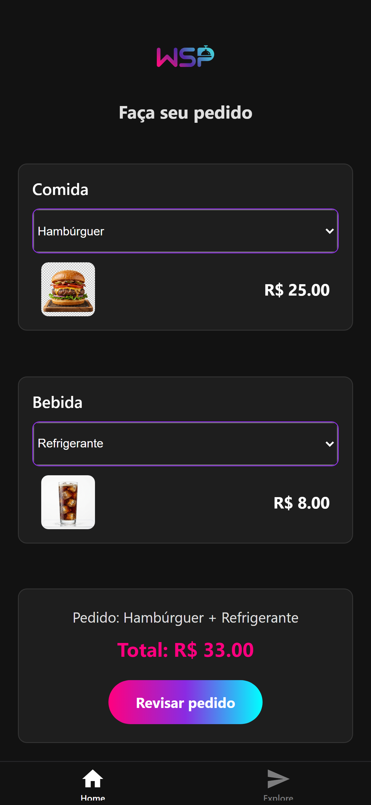
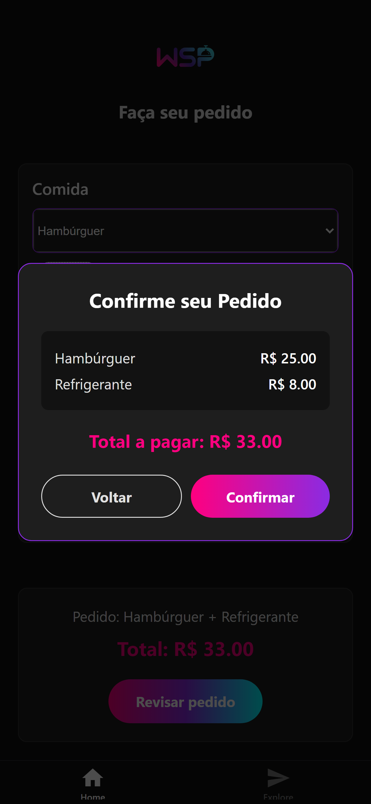
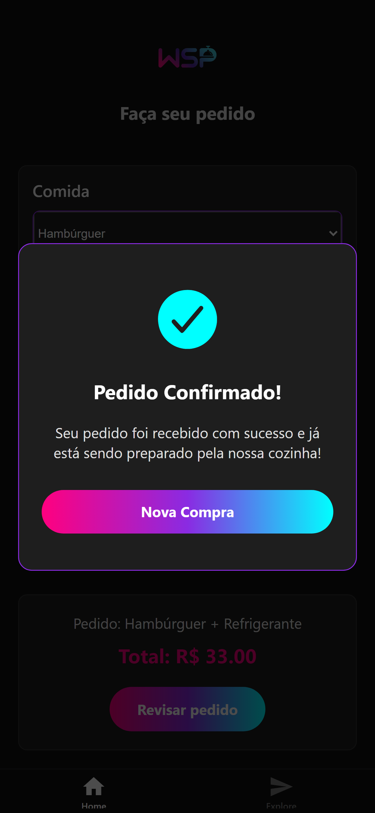

<p align="center">
  
</p>

> 🎓 Projeto desenvolvido como atividade prática para a disciplina de **Programação de Dispositivos Móveis**, do 4º semestre de Desenvolvimento de Software Multiplataforma (**DSM**) da **FATEC**.

<p align="center">
  
  &nbsp;&nbsp;&nbsp;&nbsp;
  
  &nbsp;&nbsp;&nbsp;&nbsp;
  
</p>

O **WSP Food** é um aplicativo mobile focado em cardápios e pedidos rápidos, projetado com **React Native** e **Expo**. O grande desafio proposto nesta atividade foi integrar o componente nativo `Picker` para coordenar seleções, porém optou-se por aplicar padrões de arquiteturas do mercado como o *Single Source of Truth* para garantir estabilidade do estado local.

## 📱 Principais Funcionalidades & UX

- **Selecionador Interativo:** Uso performático do `@react-native-picker/picker` para escolher rapidamente entre combos de comida e bebida.
- **Micro-Interações e Modals (Pre-fetching):** Modais fluidos para confirmação que executam a mudança de contexto sem atrasos via timers curtos (agilizando a UX vis-à-vis chamadas de back-end).
- **Design Glassmorphism Moderno:** Interface escura/neon, estilizada nativamente com cores absolutas e sobreposições. Componentização visual com `expo-linear-gradient`.
- **Acessibilidade Inspecionada (A11y):** Inclusão de roles (`accessibilityRole`), labels e regiões de foco (`accessibilityLiveRegion`) que tornam a experiência lida de ponta-a-ponta por *Screen Readers*.

## 💡 Decisões Arquiteturais (State Management)

Um dos destaques deste repositório encontra-se no tratamento dos Estados:
Em vez de depender de múltiplos retornos assíncronos a nível de tela (`useState` do Preço Final, `useEffect` mudando strings a cada re-mount), o app atua com **Derivação de Valores on-the-fly**. A cada renderização, a verdadeira fonte da verdade cruza dinamicamente o valor do lanche + o valor da bebida na view. O Preço não é um estado, **é um derivado**. Resultado: Risco Zero de falhas na sincronia das informações de pagamento.

## 🚀 Como Rodar o Projeto

### Pré-requisitos
- Node.js (v18+).
- Expo CLI (`npm install -g expo-cli`).
- Emulador de sua preferência (Android Studio / Xcode) ou o app **Expo Go** instalado no seu telefone.

### Servindo o WSP Food Localmente

1. **Clone o repositório:**
   ```bash
   git clone https://github.com/wellingtonspdev/WSP-Food.git
   cd WSP-Food
   ```

2. **Instale as dependências:**
   ```bash
   npm install
   ```

3. **Inicie o Empacotador Expo:**
   ```bash
   npx expo start
   ```

4. **Testando:**  
   Abra o **Expo Go** e escaneie o QRCode que aparece no seu terminal. Alternativamente, pressione `a` no terminal para lançar na sua instância do Android Studio, ou `i` para o simulador do iOS.

---
Feito com ☕ e código - WSP Food (Fatec DSM).
