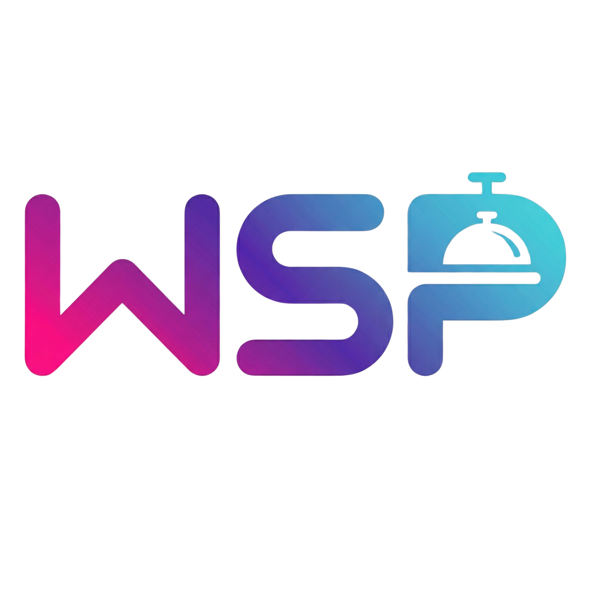

# WSP Food - App de Pedidos

<p align="center">
  
</p>

O **WSP Food** é um aplicativo mobile de demonstração e estudo para cardápios e pedidos rápidos, projetado com **React Native** e **Expo**. O aplicativo permite ao usuário escolher entre opções de comidas (hambúrgueres) e bebidas utilizando o componente nativo `Picker`, enquanto fornece visuais imersivos do produto selecionado. Quando a escolha é feita, o app mostra uma tela interativa de revisão do pedido com animações modernas.

## 📱 Principais Funcionalidades

- **Selecionador Interativo:** Uso do `@react-native-picker/picker` para escolher rapidamente entre comida e bebida.
- **Valores Dinâmicos:** Cálculo e atualização em tempo real do preço total de acordo com as escolhas.
- **Design Elegante de Dark Theme:** Componentização visual com gradientes utilizando `expo-linear-gradient` e UI/UX polido para retenção.
- **Micro-Interações e Modals:** Modal fluido para confirmação da compra, exibindo o resumo do pedido do usuário e finalização simulada para a cozinha.

## 🚀 Como Rodar o Projeto do Zero

### Pré-requisitos
- Ter o **Node.js** instalado (versão 18+ recomendada)
- Instalar a CLI do Expo rodando: `npm install -g expo-cli`
- Ter um emulador configurado no seu ambiente (Android Studio para android ou Xcode para iOS) ou então baixar o aplicativo **Expo Go** em seu smartphone (Android/iOS)

### Passo a Passo

1. **Clone o repositório**
   Primeiro, baixe o projeto para sua máquina e entre na pasta:
   ```bash
   git clone https://github.com/wellingtonsdev/WSP-Food.git
   ```

2. **Instale as Dependências**
   Rode o comando abaixo para instalar todas as bibliotecas necessárias para o projeto, incluindo React Navigation e Expo Linear Gradient:
   ```bash
   npm install
   ```

3. **Inicie o Servidor de Desenvolvimento**
   Inicie o React Native Packager usando o Expo:
   ```bash
   npx expo start
   ```

4. **Abra o App**
   Após rodar o comando, você verá um **QR Code** no terminal.
   - **Para rodar no smartphone real:** Abra o app **Expo Go** e escaneie o QR code (no iOS pode ser direto pela câmera do celular)
   - **Para rodar em um Emulador Local:** Pressione a tecla `a` no terminal para rodar o emulador Android ou a `i` para o simulador iOS.

## 🛠 Arquitetura de Pastas

- **`/app`**: Contém o roteamento principal do `expo-router`. Onde nossas páginas como `index.tsx` ficam vivas.
- **`/src/assets`**: Imagens gerais do aplicativo e do app WSP Food.
- **`/src/data`**: Dados brutos dos produtos. Listas simulando o que retornaríamos de uma API backend real.
- **`/src/components`**: Componentes genéricos de IU do sistema.

## 📚 Notas do Desenvolvedor
Dentro do código em `app/(tabs)/index.tsx`, vários comentários foram acoplados indicando onde criamos o estado da interface com `useState`, mapeando as transições de modal, e estruturando cálculos de subtotal para futuras manutenções.
